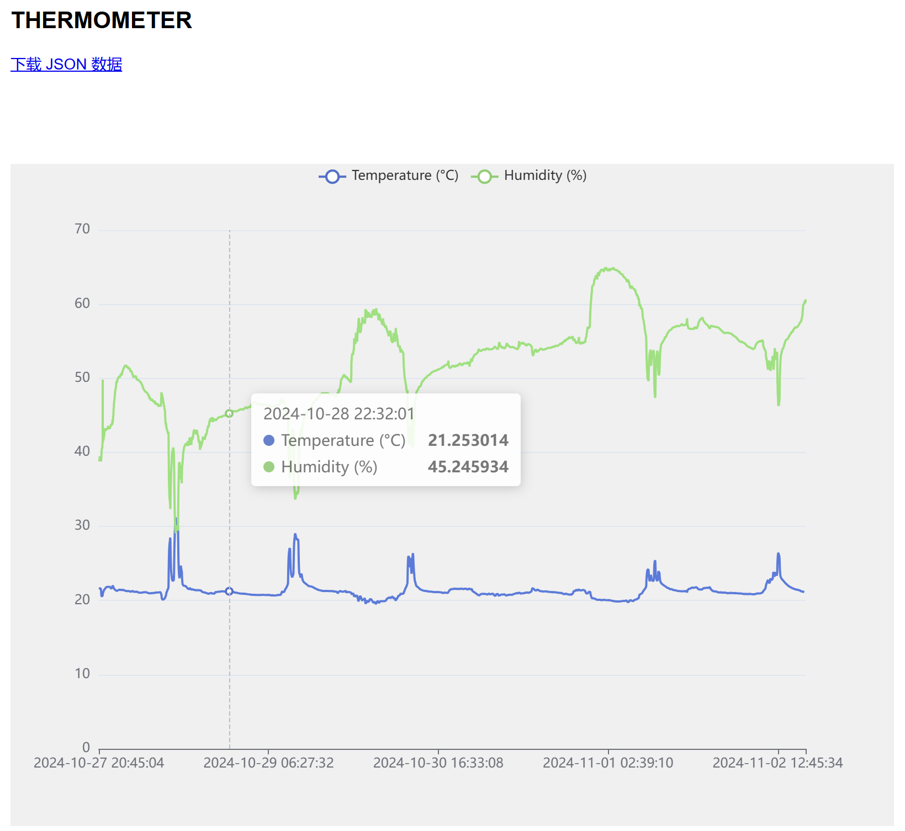

# ESP32 Thermometer

## About
*ESP32 thermometer* is a tool for collecting data on the home environment. It periodically measures the temperature and humidity and uploads them to the self-hosted server.

The device consists of the ESP32 chip, the DHT20 sensor and the SSD1306 display component. *ESP32 thermometer* is developed on **[embedded Rust (`no_std`)](https://github.com/esp-rs/esp-hal)**, so no ESP-IDF SDK is required. 



## Setup
1. Connect components using wires: ESP32 chip, the DHT21 sensor and the SSD1306 display component. Please notice the data wire should match the configuration in the source code:
    ```
    - gpio32: DHT20 sda
    - gpio33: DHT20 scl
    - gpio21: SSD1306 sda
    - gpio22: SSD1306 scl
    ```

2. Start the frontend service in an X86/ARM machine, e.g, Respberry Pi.
    ```bash
    sudo apt install python3 python3-pip
    pip install pytz flask sqlalchemy flask_sqlalchemy
    cd ./frontend
    flask initdb
    flask run --host=0.0.0.0
    ```

3. Build the sensor's binary and burn it to ESP32.
    ```bash
    export SSID="SSID"
    export PASSWORD="PASSWORD"
    cd ./sensor
    cargo run --release
    ```
    > It connects to `192.168.0.110` by default. You may need to change the frontend IP address at `main.rs:291`.

4. You can access `http://<Frontend IP>:5000` to retrieve histroy data.
